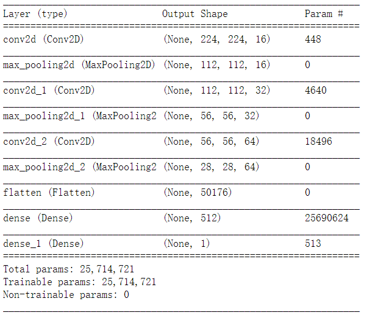
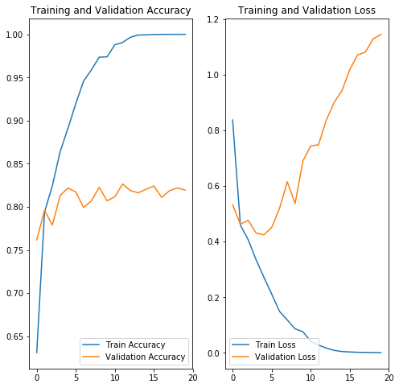
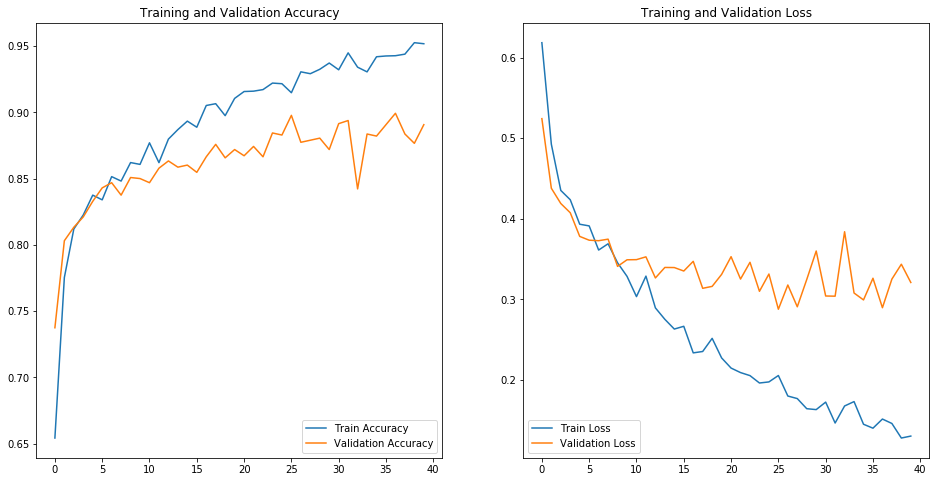
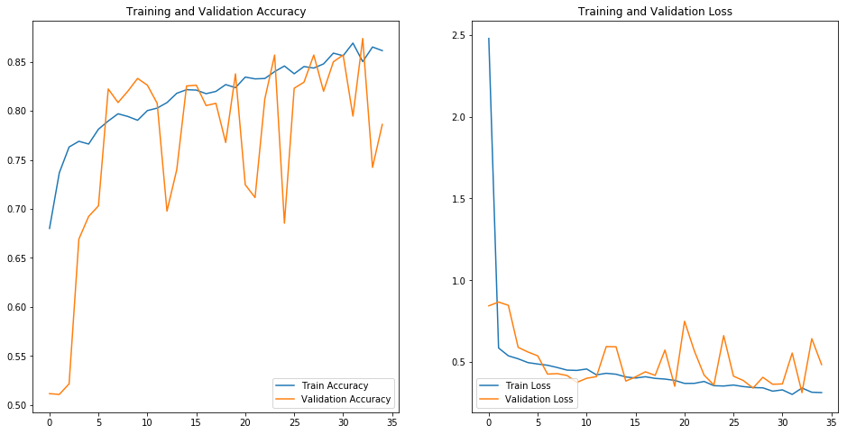
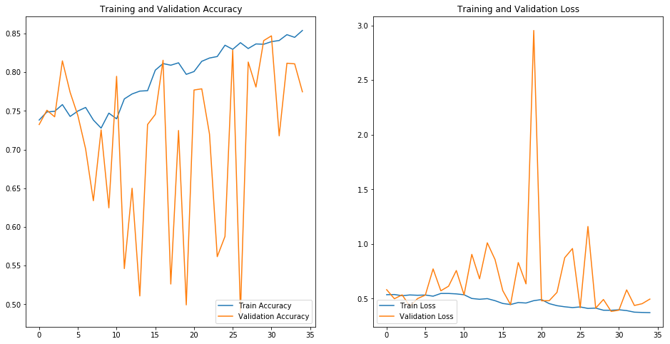
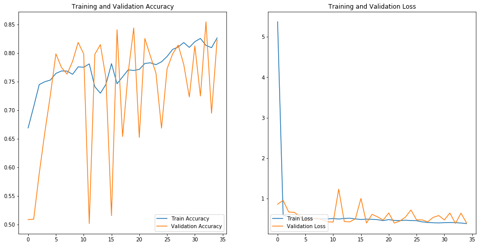

# 项目报告：动物图片识别及分类

## By：陈永焱 韩雨璇

### 项目介绍

+ 本次项目主要对一下两种模型进行了实验：
  + 二分类模型：判断图片里是否有某种动物，这次项目里对是否有猫和是否有狗分别进行了两组实验
  + 多组分类模型：判断图片里动物的种类，这次项目主要对猫的种类进行了实验

### 数据集
猫图: 16235, 有较大的噪声, 粗略估计噪声能达到40%-30%


其他图片: 15676

### 1. 二分类：判断图片是否有狗
#### 1.1 实验数据

|二分类实验|有|无|数据总数|训练验证比例|
|:--:|:--:|:--:|:--:|:--:|
|判断是否有狗|3321|3199|6520|0.2|

#### 1.2 模型

图片大小： 112 * 112

优化器：Adam （默认参数 lr=0.001）

基础模型：



#### 1.3 实验结果

|模型|正确率|损失|最优步数|备注|
|:--:|:--:|:--:|:--:|:--:|
|基础模型|0.8641 / 0.8133|0.3359 / 0.4312|4|过拟合，在epoch17时训练集正确率可达100%|
|两层Dropout(0.8)|0.9147 / 0.8977|0.2052 / 0.2878|26|Dropout概率有点高|
|FC层节点数减半|0.9078 / 0.8672|0.2314 / 0.3005|28|拟合度与不减半相似，但验证集准确率下降3%，可以在算力不够时使用|
|BN|0.9025 / 0.8898|0.2464 / 0.2897|52|由于算力不够batch size由128缩减为80，导致模型准确率和损失波动较大|

基础模型：



两层Dropout(0.8):



BN:



BN调整学习率：





### 2. 多组分类：判断图片里猫的品种
#### 2.1 实验数据

__子集__

|    |数据总数|训练集数量|验证集数量|训练验证比例|
|:--------:|:--:|:--:|:--:|:--:|
|多组分类实验|3507|2811|696|0.2|

__全集__

|    |数据总数|训练集数量|验证集数量|训练验证比例|
|:--------:|:--:|:--:|:--:|:--:|
|多组分类实验|16235|12994|3241|0.2|

#### 2.2 模型以及实验结果

__结果总结:__

+ 训练集准确率 > 45%, 损失 < 1.7
+ 验证集准确率 > 40%, 损失 ≈ 1.9

__模型以及代码:__
```python
    Conv2D(32, 3, padding='same', input_shape=(IMG_HEIGHT, IMG_WIDTH ,3)),
    Activation('relu'),
    Conv2D(32, 3),
    Activation('relu'),
    MaxPooling2D(pool_size=(2, 2), strides=(2, 2)),
    Dropout(0.25),
    Conv2D(64, 5, padding='same'),
    Activation('relu'),
    Conv2D(64, 5),
    Activation('relu'),
    MaxPooling2D(pool_size=(2, 2), strides=(2, 2)),
    Dropout(0.25),
    Flatten(),
    Dense(512),
    Activation('relu'),
    Dropout(0.5),
    Dense(classNum),
    Activation('softmax')
```

__子集__


__全集__


  

### 3. 总结与计划/问题与改进
+ 还未尝完全的数据集
+ 未加入正则化等限制和优化
  + 实际上加入之后准确率下降? 可能是为调参
+ 完整的数据集噪声很大 ，会影响结果
+ 完整的数据集算的太慢了
+ 网络本身不够完善
+ 原计划使用ResNet34或者VGG19等其他网络结构
  + _潜在问题: 训练花费太大，没有足够计算资源_
