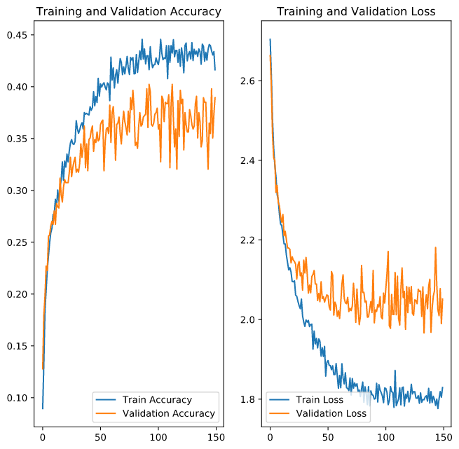

# Project Report: Animal Images Classification

## By：Chen Yongyan & Han Yuxuan

### Introduction

+ This project mainly explored models in the following situation

+ 本次项目主要对一下两种模型进行了实验：
  + 二分类模型：判断图片里是否有某种动物，这次项目里对是否有猫和是否有狗分别进行了两组实验
  + 多组分类模型：判断图片里动物的种类，这次项目主要对猫的种类进行了实验

### 1. 二分类：判断图片是否有狗
**1.1 实验数据**

|二分类实验|有|无|数据总数|训练验证比例|
|:--:|:--:|:--:|:--:|:--:|
|判断是否有狗|3321|3199|6520|0.2|

**1.2 模型以及实验结果**

### 2. 二分类：判断图片是否有猫
**2.1 实验数据**

|二分类实验|有|无|数据总数|训练验证比例|
|:--:|:--:|:--:|:--:|:--:|
|判断是否有猫|00|00|00|00|

**2.2 模型以及实验结果**

### 3. 多组分类：判断图片里猫的品种
#### 3.1 实验数据

|<br />|数据总数|训练集数量|验证集数量|训练验证比例|
|:----------:|:--:|:--:|:--:|:--:|
|多组分类实验|3507|2811|696|0.2|

#### 3.2 模型以及实验结果

```python
Conv2D(32, 3, padding='same', input_shape=(IMG_HEIGHT, IMG_WIDTH ,3)),
Activation('relu'),
Conv2D(32, 3),
Activation('relu'),
MaxPooling2D(pool_size=(2, 2), strides=(2, 2)),
Dropout(0.25),
Conv2D(64, 5, padding='same'),
Activation('relu'),
Conv2D(64, 5),
Activation('relu'),
MaxPooling2D(pool_size=(2, 2), strides=(2, 2)),
Dropout(0.25),
Flatten(),
Dense(512),
Activation('relu'),
Dropout(0.5),
Dense(classNum),
Activation('softmax')
```



### 4. 总结
